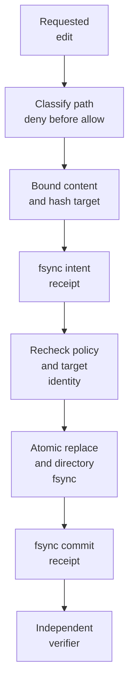

# Agent Self-Edit Gate

**Policy-enforced self-edit gateway for coding agents: let agents improve
prompts and skills without rewriting permissions, hooks, or enforcement.**

> [!IMPORTANT]
> The CLI is an enforcement boundary only when a sandbox, OS policy, or
> protected broker makes it the agent's only writer. With unrestricted shell or
> filesystem access, an agent can bypass it. Read the
> [threat model](docs/THREAT_MODEL.md) before deployment.

[](https://github.com/korovin-aa97/agent-self-edit-gate/actions/workflows/ci.yml)
[](https://pypi.org/project/agent-self-edit-gate/)
[](https://www.python.org/)
[](LICENSE)

Coding-agent behaviour and authority often live side by side:

```text
.claude/skills/reviewer/SKILL.md   behaviour: may improve
.claude/settings.json             authority: must not self-edit
.codex/agents/reviewer.toml       behaviour: may improve
.codex/config.toml                authority: must not self-edit
```

Agent Self-Edit Gate puts a deterministic write path between “the agent wants
to edit itself” and “the repository accepts that edit.” Policy is plain TOML;
decisions never depend on an LLM. Accepted writes are atomic and leave a
two-phase, hash-chained receipt.

## 15-second demo

```bash
python -m pip install "agent-self-edit-gate==0.1.1"
git clone --depth 1 --branch v0.1.1 \
  https://github.com/korovin-aa97/agent-self-edit-gate.git
cd agent-self-edit-gate
bash examples/demo.sh
```

The demo performs an allowed exact edit, verifies its two receipts, and proves
that a protected `.github/workflows` path is denied.

Install from PyPI for normal use:

```bash
python -m pip install "agent-self-edit-gate==0.1.1"
selfedit-gate --version
```

## Quickstart

Agent Self-Edit Gate supports Python 3.12+ on Linux and macOS.

```bash
evaluation_root=$(mktemp -d)
mkdir -p "$evaluation_root/.agents"
cp profiles/generic.toml "$evaluation_root/selfedit-policy.toml"
printf '%s\n' 'Review code carefully.' > "$evaluation_root/.agents/reviewer.md"
cd "$evaluation_root"

selfedit-gate --policy selfedit-policy.toml check .agents/reviewer.md
```

`root = "."` is relative to the policy file, so copy a reviewed profile into the
repository root instead of using it in place from the cloned `profiles/`
directory. For an exact edit, put the one expected old fragment and replacement
in regular files:

```bash
printf '%s\n' 'Review code carefully.' > old.txt
printf '%s\n' 'Review code and cite evidence.' > new.txt
selfedit-gate --policy selfedit-policy.toml replace .agents/reviewer.md old.txt new.txt
selfedit-gate --policy selfedit-policy.toml verify-receipts
```

For a bounded whole-file update:

```bash
printf '%s\n' 'Review code, tests, and docs.' > proposed-reviewer.md
selfedit-gate --policy selfedit-policy.toml write \
  .agents/reviewer.md proposed-reviewer.md
printf '%s\n' 'Review all evidence.' | \
  selfedit-gate --policy selfedit-policy.toml write .agents/reviewer.md -
```

Add `--json` before the command for machine-readable success or stable error
codes. Refusals exit `2`; a successful command exits `0`.
See the [error-code reference](docs/ERROR_CODES.md) for automation.

## Policy in one screen

```toml
schema_version = 1

[gate]
root = "."
receipt_log = ".selfedit-gate/receipts.jsonl"
max_bytes = 262144
max_changed_bytes = 65536
allow_create = false

[[zones]]
name = "behaviour"
mode = "mutable"
patterns = ["AGENTS.md", ".agents/**/*.md"]
extensions = [".md"]

[[zones]]
name = "authority"
mode = "immutable"
patterns = ["selfedit-policy.toml", ".selfedit-gate/**", ".github/**"]
```

Protected and immutable matches always override mutable matches. The gate also
refuses traversal, symlink components, unsupported extensions, non-UTF-8/NUL
content, oversized files/diffs, ambiguous replacement anchors, owner/type
changes, policy swaps, target races, and audit failures.

See the complete [policy reference](docs/POLICY_REFERENCE.md) and ready-to-copy
[generic](profiles/generic.toml), [Claude Code](profiles/claude-code.toml), and
[Codex](profiles/codex.toml) profiles.

## What happens on a write



Every receipt names the exact policy, before bytes, proposed bytes, operation,
and prior receipt hash. A crash between intent and commit leaves a dangling
intent that verification refuses. Details and canonicalization rules are in
[the receipt protocol](docs/RECEIPTS.md).

## Where enforcement comes from

| Deployment | What the gate provides | Security boundary? |
| --- | --- | --- |
| Agent voluntarily invokes the CLI | predictable edits and local audit trail | No |
| Protected CI verifies receipts and Git diff | independent detection before merge | Yes, at merge time |
| OS-isolated writer/broker is the only process that can modify behaviour files | prevention plus receipts | Yes, at write time |
| Project-local hook the agent can rewrite | convenience interception | No |

The [deployment guide](docs/DEPLOYMENT.md) describes each pattern without
pretending a CLI can sandbox its own caller.

## Scope compared with adjacent tools

| Approach | Primary job | This project |
| --- | --- | --- |
| Claude Code/Codex permissions and sandboxing | control tools and execution | uses them as an external trust anchor |
| General agent/MCP gateway | govern tool or protocol traffic | intentionally narrower; mutates repository files |
| Skill registry/package manager | distribute and scan skills | edits already-installed behaviour under local policy |
| Git branch protection/CODEOWNERS | review and merge governance | supplies file-level mutation receipts before review |

The dated [landscape check](docs/COMPETITORS.md) cites direct sources and
explains the positioning. This is not a generic “AI firewall.”

## Security limits

- Receipts are tamper-evident hash chains, not signatures or identities.
- Allowed prompt content can still be malicious; the gate controls *where and
  how much*, not semantic safety.
- Network filesystems and Windows are unsupported in v0.1.
- v0.1 has not received an independent professional security audit.
- Recovery from a dangling intent is deliberately manual.

Please use [GitHub private vulnerability reporting](SECURITY.md), not a public
issue, for suspected vulnerabilities.

## Development

```bash
git clone https://github.com/korovin-aa97/agent-self-edit-gate.git
cd agent-self-edit-gate
uv sync --all-groups
uv run ruff check .
uv run ruff format --check .
uv run mypy src tests
uv run pytest --cov=selfedit_gate --cov-report=term-missing
uv build
```

The runtime has no third-party dependencies. See [CONTRIBUTING.md](CONTRIBUTING.md),
the [changelog](CHANGELOG.md), and the [public roadmap](docs/ROADMAP.md).

## Origin and license

Built from operating a mixed Claude/Codex production fleet, then extracted as a
narrow standalone tool without fleet orchestration, telemetry, or hosted
control plane.

Licensed under [Apache-2.0](LICENSE).
